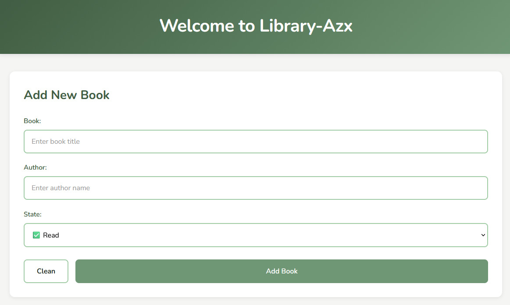

# 📚 My Personal Library

A progressive web application to manage your personal book collection in an intuitive and elegant way.

## 🎯 Description

My Personal Library is a tool designed for readers who want to organize, track, and rate the books they have read, are reading, or plan to read. With a clean and minimalist interface, it allows you to keep a detailed record of your reading progress without complications.

## ✨ Current Features

- ✅ Add books with title, author
- ✅ Classify books by status: "To Read", "Reading", or "Read"
- ✅ Remove books from the collection
- ✅ Local data persistence using localStorage
- ✅ Intuitive interface with natural and relaxing color palette

## 🛠️ Technologies Used

### Frontend (Current)
- HTML5
- CSS3 (Flexbox & Grid)
- Vanilla JavaScript (ES6+)
- localStorage API

### Backend (Planned)
- Node.js + Express
- MongoDB / PostgreSQL
- JWT Authentication
- RESTful API


## 📦 Installation and Usage

### Clone the repository
```bash
git clone https://github.com/Angel0zzx/library-azx.git
cd library-azx
```

### Open the project
Simply open the `index.html` file in your favorite browser. No additional installation required.

### Local usage
1. Open `index.html` in your browser
2. Start adding books using the form
3. Your data will be automatically saved in your browser

## 🌐 Live Demo

🔗 [View Demo](https://github.com/Angel0zzx/library-azx.git) *(Coming soon)*

## 📸 Screenshots



## 🤝 Contributing

This is a personal learning project, but suggestions and feedback are welcome. If you find any bugs or have ideas to improve the application, feel free to open an issue.

## 👨‍💻 Author

**Angel0zzx**
- [GitHub](https://github.com/Angel0zzx)
- Email: roa06138@gmail.com

## 🙏 Acknowledgments

- To the developer community for resources and tutorials
- To all readers who inspire projects like this

---

⭐ If you find this project useful, consider giving it a star on GitHub

**Project Status**: 🚧 In active development